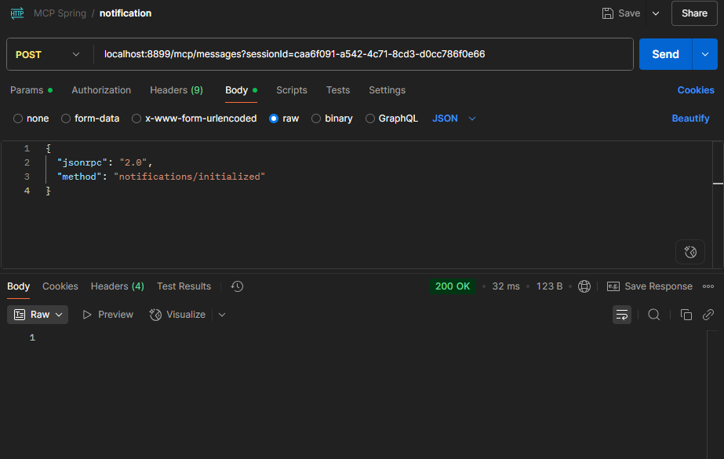
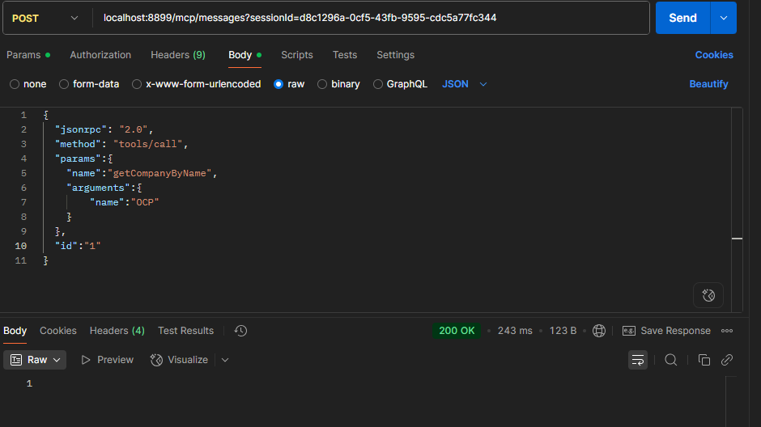
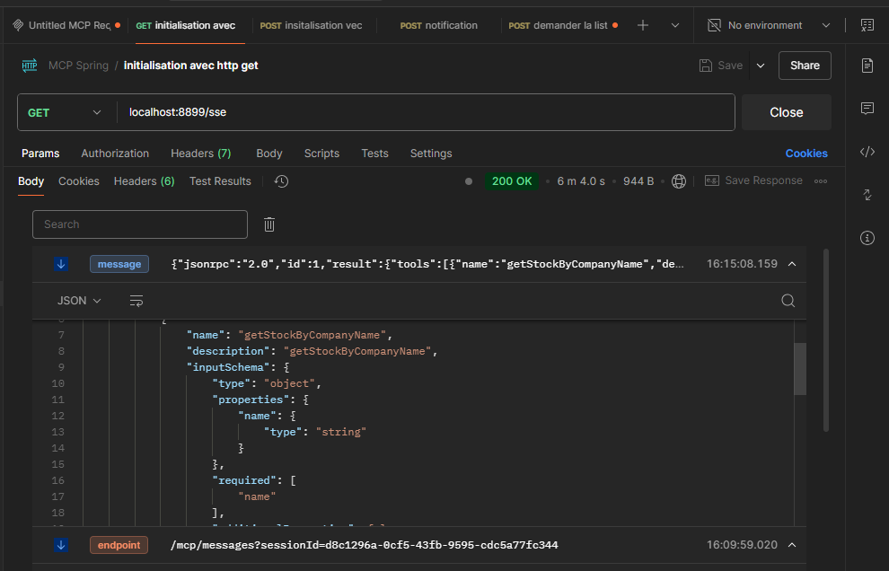
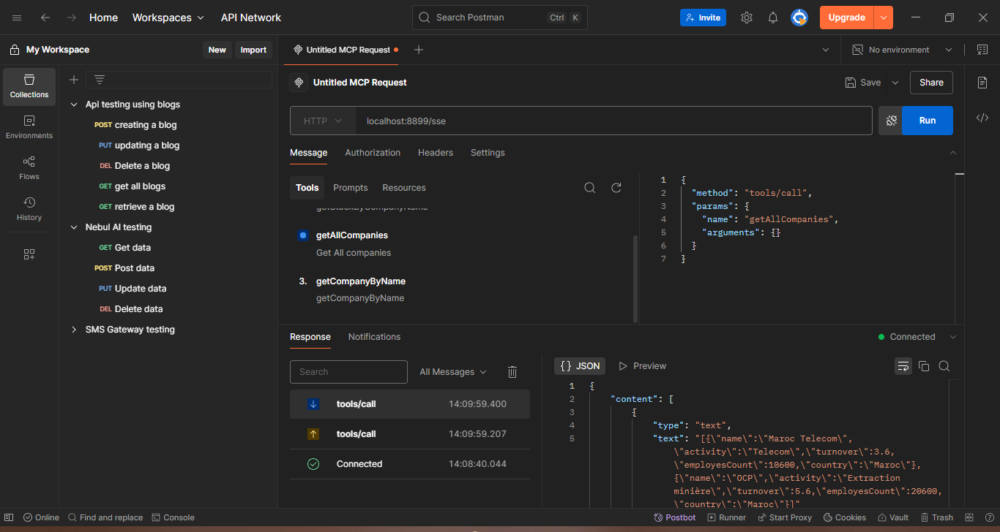
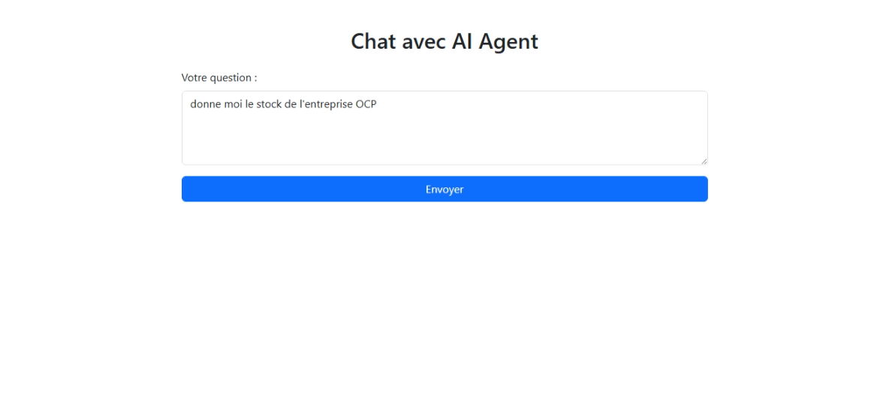
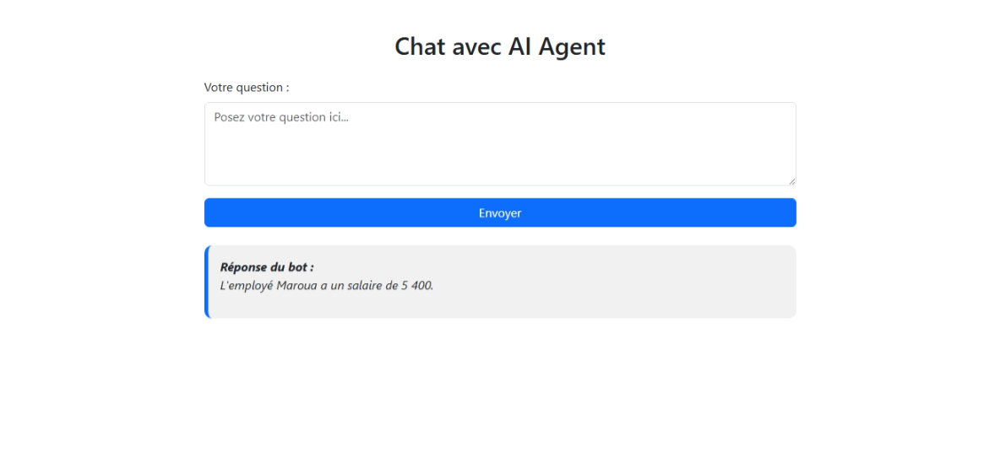
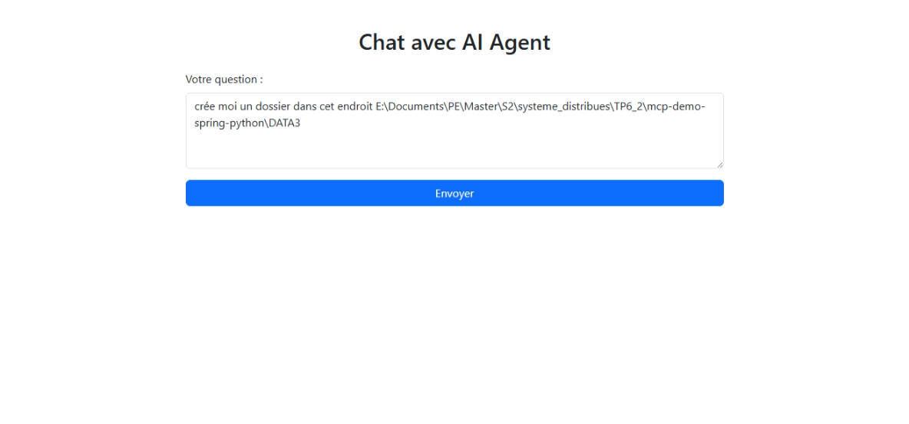
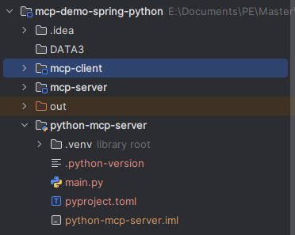

# MCP Spring
* Nom et prénom : OURAHMA Maroua.
* Etablissement : Faculté des sciences, Meknès.

---

## Introduction
Ce projet démontre l'intégration d'un agent intelligent basé 
sur le protocole MCP (Model Context Protocol) au sein d'une 
application Spring Boot. L’objectif principal est de faciliter 
l'accès à des fonctionnalités métiers spécifiques, telles que 
`getCompanyByName`, `getAllCompanies`, etc., à travers des outils 
IA personnalisés enrichis par une mémoire contextuelle.

L’architecture repose sur les composants suivants :

* Des tools MCP personnalisés, exposant des méthodes backend (par exemple : recherche d'entreprises, agrégation de données) à l'agent IA.
* Un agent IA connecté via Spring AI, capable de dialoguer dynamiquement avec ces tools et d’interagir avec l’utilisateur.
* Une mémoire contextuelle, permettant à l’agent de conserver un historique des appels (méthodes, résultats, intentions), afin d’améliorer la pertinence des réponses futures.

Le projet met en place un système distribué dans lequel :

* Le serveur expose les tools (via un serveur MCP basé sur Node.js ou Python),
* Le client Spring Boot s'y connecte de manière asynchrone (McpSyncClient ou McpAsyncClient),

L’utilisateur peut interagir avec l’agent (ex : via Postman, une UI ou ligne de commande) pour exécuter des commandes métier en langage naturel.

---

## Configuration de serveur:
* La classe `StockTools.java`:

  La classe StockTools définit un ensemble de méthodes métiers simulant des opérations sur des entreprises (Company) et leurs actions (Stock).
  Son but est d’exposer ces méthodes comme des "tools" accessibles à un agent IA, via Spring AI et le protocole MCP
````java
package net.ourahma.mcpserver.tools;

import jdk.jfr.Description;
import org.springframework.ai.tool.annotation.Tool;
import org.springframework.stereotype.Service;

import java.time.LocalDate;
import java.util.List;


public class StockTools {
    private List<Company> companies = List.of(
            new Company("Maroc Telecom","Telecom",3.6,10600,"Maroc"),
            new Company("OCP","Extraction minière",5.6,20600,"Maroc")
    );
    @Tool(description = "Get All companies")
    public List<Company> getAllCompanies() {
        return this.companies;
    }


    public void setAllCompanies(List<Company> companies) {
        this.companies = companies;
    }
    @Tool
    public Company getCompanyByName(String name) {
        return this.companies.stream().filter(c -> c.name().equals(name)).findFirst().orElseThrow(()->new RuntimeException("Company not found"));
    }
    @Tool
    public Stock getStockByCompanyName(String name) {
        return new Stock(name,LocalDate.now(),300 + Math.random()*300);
    }

}


record Company(
        String name,String activity,
        @Description("The turnover In Millard MAD")
        double turnover,
        int employesCount,
        String country){}

record Stock(String companyName, LocalDate date, double stock){}
````

* `@Tool` : Lors du démarrage, Spring détecte automatiquement ces méthodes 
et les enregistre dans la liste des tools disponibles pour l’agent.
* `@Description` : Elle sert probablement à documenter les champs 
pour générer un schéma JSON plus lisible, mais dans un contexte Spring AI, cette annotation n’a pas d’impact direct.

**Le lancement de serveur permet d'exposer les tools**:
```java
@Bean
    public MethodToolCallbackProvider getMethodToolCallbackProvider() {
        return MethodToolCallbackProvider.builder()
                .toolObjects(new StockTools())
                .build();
    }
```
Donc par la suite le serveru est lancé après configuration et les tools sont exposés.


**Test avec `PostMan`**



**Demander un tool**


 
Voici le résultat:


**Demander la liste des tools**


Voici le résultat:



**Avec le protocole MCP**:



---

## Configuration de client

**La classe `AIAgent.java`**:

Cette classe sert à encapsuler un agent conversationnel IA basé sur Spring AI, capable :

* de répondre à des requêtes utilisateur en langage naturel (askLLM(...)),
* en s’aidant d'outils personnalisés (tools),
* et avec une mémoire de contexte sur les derniers échanges (fenêtre de mémoire des messages).

````java
package net.ourahma.mcpclient.agents;

import org.springframework.ai.chat.client.ChatClient;
import org.springframework.ai.chat.client.advisor.MessageChatMemoryAdvisor;
import org.springframework.ai.chat.memory.MessageWindowChatMemory;
import org.springframework.ai.tool.ToolCallbackProvider;
import org.springframework.stereotype.Service;

@Service
public class AIAgent {
    private ChatClient chatClient;

    public AIAgent(ChatClient.Builder chatClient, ToolCallbackProvider toolCallbackProvider) {
        this.chatClient = chatClient
                .defaultToolCallbacks(toolCallbackProvider)
                .defaultSystem("Answer the user question using the provided tools")
                .defaultAdvisors(MessageChatMemoryAdvisor.builder(
                        MessageWindowChatMemory.builder().maxMessages(20).build()
                ).build())
                .build();
    }

    public String askLLM(String query) {
        return chatClient.prompt()
                .user(query)
                .call()
                .content();
    }

}

````

* `@Service`: Marque la classe comme un bean Spring géré automatiquement, injectable dans d'autres composants.
* `public String askLLM(String query)` : Cette méthode Envoie le message via chatClient.prompt().user(query).call() 
puis elle récupère et retourne la réponse du LLM avec .content().

**Tester le client et récupérer les tools**
````java
package net.ourahma.mcpclient;

import io.modelcontextprotocol.client.McpSyncClient;
import io.modelcontextprotocol.spec.McpSchema;
import org.springframework.boot.CommandLineRunner;
import org.springframework.boot.SpringApplication;
import org.springframework.boot.autoconfigure.SpringBootApplication;
import org.springframework.context.ApplicationContext;
import org.springframework.context.annotation.Bean;

import java.util.List;

@SpringBootApplication
public class McpClientApplication {

    public static void main(String[] args) {
        SpringApplication.run(McpClientApplication.class, args);
    }


    @Bean
    public CommandLineRunner commandLineRunner(List<McpSyncClient> clients) {

        return args -> {
            clients.forEach(client ->{
                client.listTools().tools().forEach(tool -> {

                    System.out.println("==================");
                    System.out.println(tool.name());
                    System.out.println(tool.description());
                    System.out.println(tool.inputSchema());
                    System.out.println("==================");
                });
            });
            System.out.println("==========================");
            String params= """
                    {
                        "name":"OCP"
                    }
                    
                    """;
            // appeler un seul tool
            McpSchema.CallToolResult result= clients.get(0).callTool(new McpSchema.CallToolRequest(
                    "getCompanyByName",params
            ));
            System.out.println("==========================");
            McpSchema.Content content= result.content().get(0);
            if(content instanceof  McpSchema.TextContent){
                McpSchema.TextContent textContent = (McpSchema.TextContent) content;
                System.out.println("================");
                System.out.println(textContent.text());
            }

        };
    }

}

````
Cette méthode est annoté avec l'annotation `@Bean` ce qui signifie qu'elle va être
exécuté au démarrage pour affichier la liste des tools dans le teminal voici le résultat : 


**Récupérer la company `OCP` avec le tool `GetCompanyByName`**


**Intégration de `AIAgent.class`**

La classe AIAgent agit comme un pont entre l'application et un modèle LLM (comme Llama3 via Ollama), en encapsulant :

* la gestion des outils personnalisés (annotés via `@Tool` dans d'autres classes),
* une mémoire de conversation (utile pour garder du contexte sur plusieurs échanges),
* et l'appel direct au modèle LLM via le client Spring AI (ChatClient).

Elle permet ainsi à l'application de poser dynamiquement des questions à un agent IA qui utilise des outils métiers définis par vous-même.

````java
package net.ourahma.mcpclient.agents;

import org.springframework.ai.chat.client.ChatClient;
import org.springframework.ai.chat.client.advisor.MessageChatMemoryAdvisor;
import org.springframework.ai.chat.memory.MessageWindowChatMemory;
import org.springframework.ai.tool.ToolCallbackProvider;
import org.springframework.stereotype.Service;

@Service
public class AIAgent {
    private ChatClient chatClient;

    public AIAgent(ChatClient.Builder chatClient, ToolCallbackProvider toolCallbackProvider) {
        this.chatClient = chatClient
                .defaultToolCallbacks(toolCallbackProvider)
                .defaultSystem("Answer the user question using the provided tools")
                .defaultAdvisors(MessageChatMemoryAdvisor.builder(
                        MessageWindowChatMemory.builder().maxMessages(20).build()
                ).build())
                .build();
    }

    public String askLLM(String query) {
        return chatClient.prompt()
                .user(query)
                .call()
                .content();
    }

}

````
**Le test**

Voici le test après demander à ollama la liste des entreprises.


**Demander des informations sur OCP**


## Configuration de Serveur python:

Créer un serveur MCP (Model Chat Protocol) 
en Python avec la bibliothèque `fastmcp`. Il expose une fonction 
`get_employee_info` comme un outil que le modèle de 
langage pourra appeler via le protocole MCP.
````python
  from mcp.server.fastmcp import FastMCP
  
  mcp = FastMCP("Python MCP server")
  
  @mcp.tool
  def get_employee_info(name:str) -> str:
    """
    Get Info about given employee name
    :param name: employee name
    :return: dictionary 
    """
      return {
          "employee_name" :name,
          "salary":5400
      }
````

* `@mcp.tool`:qui marque la fonction get_employee_info comme un outil utilisable via MCP.
* `def get_employee_info(name:str) -> str`: déclaration d'une fonction qui prend un paramètre name de type str et retourne une chaîne de caractères.
* La description de fonction est configuré avec le bloc commentaire.

**Le test**

Après lancer le client avec deux serveur configurées , voici le nouveau tool de de python-server lister dans le terminal.


## Configuration de l'UI

Après ajout de controller `CharController.java` pour gérer les templates, et la réponse. Il s'aggit de taper la requête et `llama3.1` pour la réponse.



**La résponse est la suivante**


**Demander à l'agent les informations sur un employe**


**La réponse de l'agent**


**Créer un dossier**



**Le dossier est crée**


---

## Conclusion.
Ce projet met en œuvre un système multi-agents basé sur le protocole MCP (Model Context Protocol) permettant à un LLM (LLaMA 3.1) de dialoguer avec des serveurs Python et Java exposant des outils métiers.

Étapes principales :
1. Création d’un serveur Python avec FastMCP, exposant l’outil get_employee_info.
2. Création d’un serveur Java MCP avec des outils : getAllCompanies et getCompanyByName...
3. Configuration du client Spring Boot avec spring-ai pour interroger les serveurs MCP.
4. Création d’une interface utilisateur (chat) avec Spring MVC et Bootstrap.
5. Interaction avec le LLM, qui choisit automatiquement quel outil appeler selon la requête utilisateur.

Le projet démontre une intégration fluide entre LLM, outils métiers et interface web grâce au protocole MCP.